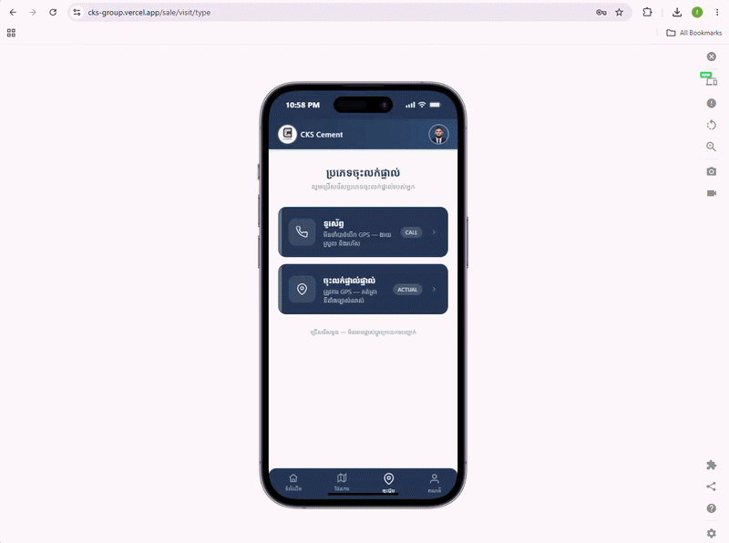
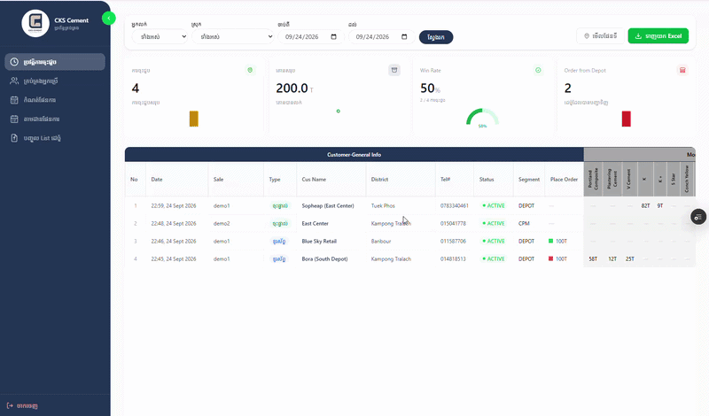
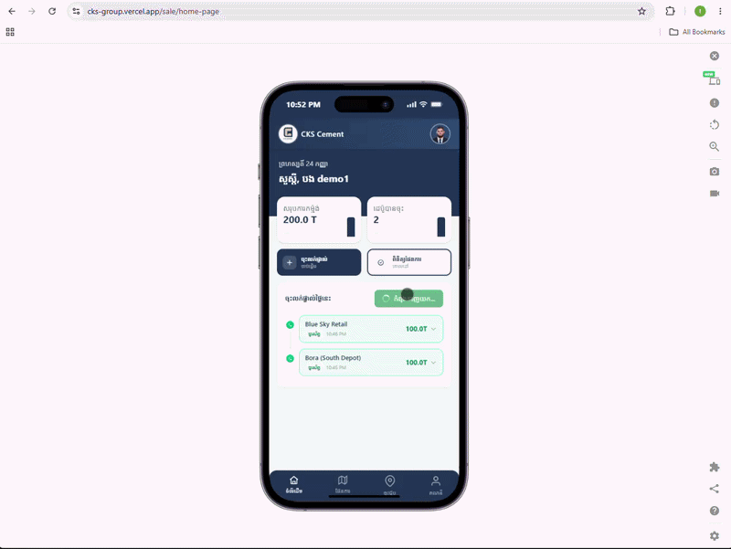
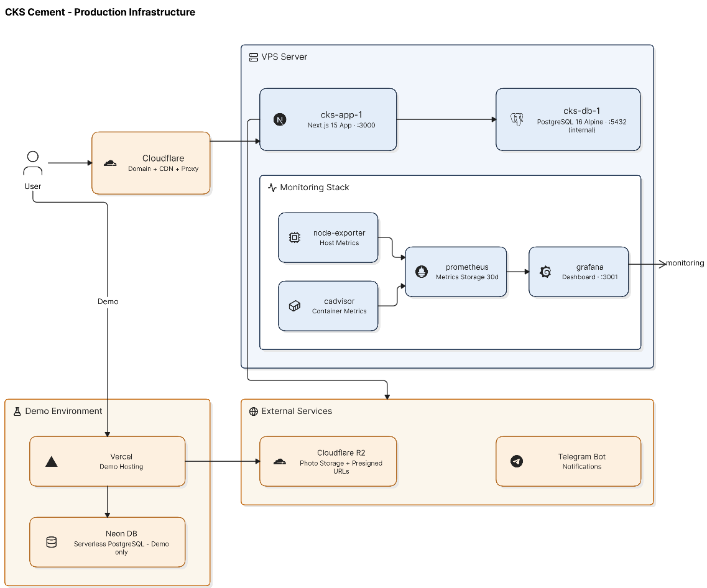

  
  <h1>CKS Cement — Field Sales Management System</h1>
  
A full-stack internal tool for managing field sales visits, depot data, and sales goal tracking across districts.

  
<em>Sales management system built during internship at a $1M+ revenue cement distributor.</em>

  
  
  
  
  

---

## 🔗 Live Demo

**Demo URL:** https://cks-group.vercel.app

| Role | Username | Password |
|------|----------|----------|
| Sales Rep | `demo1` | `demo123` |
| Sales Rep | `demo3` | `demo123` |
| Marketing | `demo2` | `demo123` |

> Demo data is fictional. Admin access is disabled in the demo.

---

## Preview

### Visit Submission & History

### Admin Dashboard & Goal Tracking

### Homepage, Goals & Profile

---

## Features

### Sales Rep (SALE role)
- Submit depot visits with GPS location, photos, order items, and sale notes
- View personal visit history on an interactive map
- Track assigned districts and depot list

### Marketing (MARKETING role)
- View all visits across all districts
- Access full depot map with visit data
- Monitor sales performance across regions

### Admin
- Import / export depot list via Excel
- Set sales goals per district per salesperson (drag-and-drop assignment)
- Track actual vs target volume and depot count
- Import actual volume data via Excel
- Manage users (create, edit, deactivate)
- Telegram notifications for new visits and daily reports

---

## Tech Stack

| Layer | Technology |
|-------|-----------|
| Frontend | Next.js 15 (App Router, Server Actions) |
| Database | PostgreSQL 16 + Prisma ORM |
| Auth | NextAuth.js (JWT, role-based) |
| Storage | Cloudflare R2 (presigned URL upload) |
| Hosting (demo) | Vercel + Neon DB |
| Hosting (prod) | VPS + Docker |
| Monitoring | Prometheus + Grafana + cAdvisor |
| Notifications | Telegram Bot API |
| Domain/CDN | Cloudflare |

---

## System Architecture

---

## Database Backup

Production database is backed up via scheduled pg_dump stored on the VPS, ensuring data recovery in case of failure.

---

  Built during internship at CKS Cement Group · 2026

